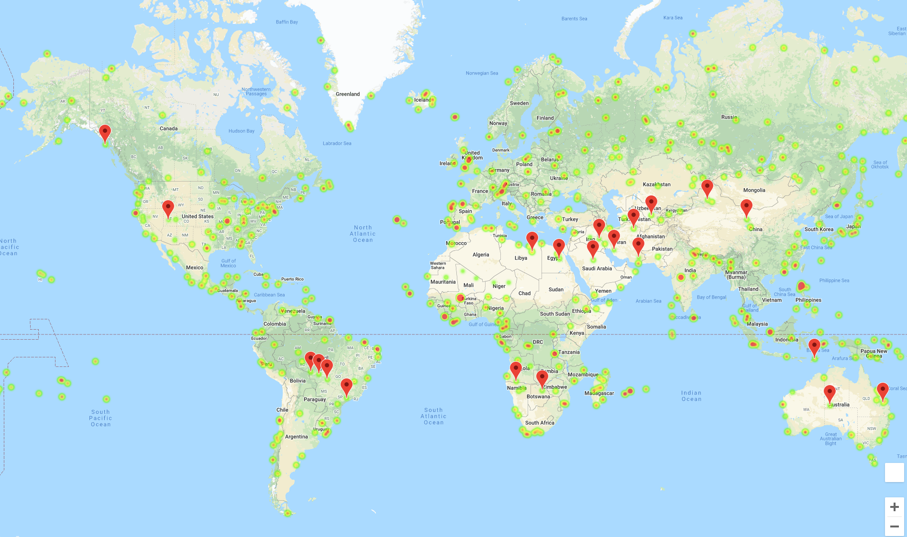

# WeatherPy

This is a homework assignment for Rice's Data Analysis and Visualization Bootcamp

Using Python code we gathered a list of 500+ cities across the world. Then using the OpenWeatherMap API, we created a model that found what the climate conditions were in this specific city. The goal was to see if there were any trends/patterns/relationship between a city's latitude (i.e how close to the equator it is) and the climate in this city. For this we looked at the following comparisons:

 - Latitude vs Temperature (F)
 - Latidude vs Humidity (%)
 - Latitude vs Cloudiness (%)
 - Latitude vs Wind Speed
 
 From running a linear regression across these comparisons, the following  can be drawn:
 
 The most obvious correlation is that the closer a city is to the equator, either north or south of it. The higher the temperature tends to be. Cities tend to be warmer the closer to the equator they are, which is when latitude is equals to 0. Summer is coming to an end in the northern hemisphere so temperatures are balancing out with those in the southern hemisphere where the summer season is about to begin

This was the only strong relationship from the data analyzed. There were no strongs relationships between a city's latitude and it's humidity, is cloudiness and how windy it is.

However it was interesting to see that there is a lot of cities with clear skies (cloudiness = 0) as well as a big block of cities with cloudiness ~80% & ~100%.

Also understandably so, winds tend to oscillate between 0 and 15mph regardless of a city's location in the hemisphere.

# VacationPy

In a brief continuation using the data from the cities found above, we now created a heatmap based on the humidity of these cities and then using the Google Places API we also marked hotels on those cities that meet some criteria determined as ideal. Such as temperatures between 60 and 85 degrees (F), low humidity, without many clouds.

These markers contain an info label that contain the name of the city, the country the city is located and the closest hotel to it for easy reference

 